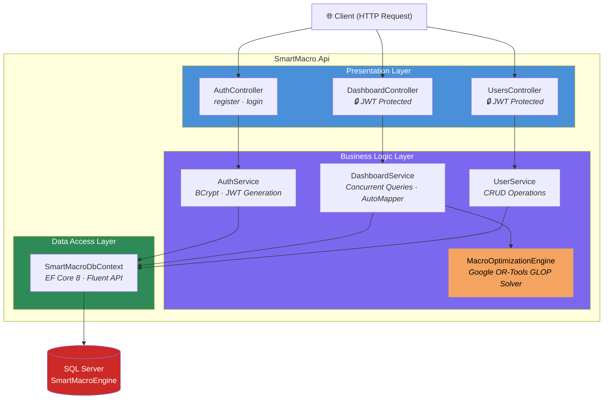

# SmartMacro Engine — Constraint-Based Nutritional Optimization API


**SmartMacro Engine** là hệ thống Backend API cung cấp giải pháp tối ưu hóa dinh dưỡng tự động cho người tập thể hình. Điểm nhấn cốt lõi của dự án là sử dụng thuật toán **Quy hoạch tuyến tính (Linear Programming)** thông qua bộ giải **Google OR-Tools GLOP** để tự động tính toán khối lượng (gram) chính xác của từng loại thực phẩm — dựa trên mục tiêu Macro hàng ngày (Protein, Carbs, Fat, Kcal) và lượng tồn kho thực tế của người dùng — nhằm tối thiểu hóa sai lệch dinh dưỡng và lãng phí thực phẩm.

---

## 📌 Tính Năng Chính

- **Algorithmic Meal Optimization** — Giải bài toán tối ưu ràng buộc bằng Linear Programming (GLOP Solver) để phân bổ khẩu phần ăn tối ưu từ kho nguyên liệu thực tế.
- **Dynamic Workload Adaptation** — Tự động điều chỉnh mục tiêu Carb/Protein/Fat dựa trên chu kỳ tập luyện (Push / Pull / Legs / Rest) thông qua bảng `macro_adjustment_rules`.
- **JWT Authentication** — Xác thực người dùng bằng JSON Web Tokens với mật khẩu được mã hóa BCrypt.
- **Chunky Dashboard API** — Endpoint tổng hợp trả về toàn bộ dữ liệu Dashboard trong MỘT response duy nhất, sử dụng truy vấn song song (`Task.WhenAll`) để tối ưu hiệu năng.
- **Automated Unit Testing** — Các thuật toán cốt lõi được kiểm thử kỹ lưỡng bằng xUnit với phương pháp Equivalence Partitioning và Boundary Value Analysis.

---

## 💻 Tech Stack

| Layer | Technology |
|---|---|
| **Framework** | .NET 8 / C# Web API |
| **Database ORM** | Entity Framework Core 8 (Code-First Migrations) |
| **Database Engine** | SQL Server (via SQL Server Express / SSMS) |
| **Security** | JWT (JSON Web Tokens) & BCrypt Password Hashing |
| **Algorithm Engine** | Google.OrTools — GLOP Linear Solver |
| **Object Mapping** | AutoMapper |
| **API Documentation** | Swashbuckle (Swagger UI) |
| **Testing** | xUnit, Moq, FluentAssertions, Coverlet (Code Coverage) |
| **CI/CD** | GitHub Actions (.NET 8 Build → Test → Coverage Report) |

---

## 🚀 Getting Started (Setup cho Dev mới)

### Yêu cầu
- .NET 8 SDK
- SQL Server Express (hoặc bất kỳ SQL Server instance nào)
- `dotnet-ef` tool (đã có trong `dotnet-tools.json` — tự động restore)

### Các bước

```bash
# 1. Clone repo
git clone https://github.com/LetIvanCook/SmartMacro-Engine.git
cd SmartMacro-Engine

# 2. Restore tools (.NET local tools — bao gồm dotnet-ef)
dotnet tool restore

# 3. Cấu hình connection string
# Sửa Server= trong SmartMacro.Api/appsettings.json cho phù hợp môi trường của bạn.
# Mặc định: Server=.\SQLEXPRESS;Database=SmartMacroEngine

# 4. Tạo database từ migrations (không cần chạy SQL script thủ công)
dotnet tool run dotnet-ef database update --project SmartMacro.Api --startup-project SmartMacro.Api

# 5. Chạy API
dotnet run --project SmartMacro.Api
```

> **Lưu ý:** Sau bước 4, database sẽ được tạo hoàn chỉnh gồm tất cả bảng, index,
> và constraint. Không cần script SQL bổ sung. Nếu có migration mới sau khi pull code,
> chạy lại lệnh `database update` là đủ.

---

## 🏗️ Kiến Trúc Hệ Thống

Dự án tuân thủ nghiêm ngặt **kiến trúc phân lớp (Layered Architecture)** với Dependency Injection xuyên suốt:



---

## 📂 Cấu Trúc Dự Án

```
SmartMacro-Engine/
├── SmartMacro.Api/                  # Main API Project
│   ├── Controllers/                 # Presentation Layer — API Routing
│   │   ├── AuthController.cs        #   POST register, login
│   │   ├── DashboardController.cs   #   GET  dashboard (JWT protected)
│   │   └── UsersController.cs       #   GET, PUT, DELETE user (JWT protected)
│   ├── DTOs/                        # Data Transfer Objects
│   │   ├── AuthDTOs.cs              #   Register/Login request & response
│   │   ├── DashboardDTOs.cs         #   Composite Dashboard response
│   │   └── UserDTOs.cs              #   User detail & update DTOs
│   ├── Engines/                     # Algorithm Engine
│   │   ├── IMacroOptimizationEngine.cs
│   │   ├── MacroOptimizationEngine.cs  # LP Solver (Google OR-Tools GLOP)
│   │   └── OptimizationResult.cs
│   ├── Interfaces/                  # Service Contracts
│   │   ├── IAuthService.cs
│   │   ├── IDashboardService.cs
│   │   └── IUserService.cs
│   ├── Models/                      # EF Core Entities & DbContext
│   │   ├── SmartMacroDbContext.cs    #   11 Entities · Fluent API Config
│   │   ├── User.cs
│   │   ├── Food.cs
│   │   ├── DailyTarget.cs
│   │   ├── UserFoodInventory.cs
│   │   ├── MealLog.cs
│   │   └── ...                      #   + 6 more entity files
│   ├── Profiles/                    # AutoMapper Profiles
│   ├── Services/                    # Business Logic Implementation
│   │   ├── AuthService.cs           #   BCrypt hashing · JWT generation
│   │   ├── DashboardService.cs      #   Task.WhenAll concurrent queries
│   │   └── UserService.cs           #   User CRUD wrapper
│   ├── Program.cs                   # Application entry point & DI config
│   ├── appsettings.json             # Connection string & JWT config
│   └── SmartMacro.Api.csproj
│
├── SmartMacro.Tests/                # Unit Test Project (xUnit)
│   ├── AuthServiceTests.cs          #   Auth logic verification
│   ├── DashboardServiceTests.cs     #   EF InMemory + AutoMapper tests
│   ├── Engines/
│   │   └── MacroOptimizationEngineTests.cs  # EP & BVA test cases
│   └── SmartMacro.Tests.csproj
│
├── .github/workflows/
│   └── dotnet-ci.yml                # CI: Build → Test → Coverage Report
├── SmartMacroEngine.slnx            # Solution file
└── README.md
```

---

## 🚀 Getting Started

### Yêu Cầu Hệ Thống

- [.NET 8 SDK](https://dotnet.microsoft.com/download/dotnet/8.0) (v8.0+)
- [SQL Server](https://www.microsoft.com/en-us/sql-server/sql-server-downloads) (Express hoặc Developer Edition)
- Git

### 1. Clone Repository

```bash
git clone https://github.com/LetIvanCook/SmartMacro-Engine.git
cd SmartMacro-Engine
```

### 2. Cấu Hình Database & JWT

Mở file `SmartMacro.Api/appsettings.json` (hoặc tạo `appsettings.Development.json` để override) và cập nhật:

```jsonc
{
  "ConnectionStrings": {
    // Thay đổi Server name phù hợp với môi trường của bạn
    "DefaultConnection": "Server=.\\SQLEXPRESS;Database=SmartMacroEngine;Trusted_Connection=True;TrustServerCertificate=True;"
  },
  "Jwt": {
    // ⚠️ QUAN TRỌNG: Thay bằng secret key riêng, tối thiểu 32 ký tự
    "Key": "YOUR_SUPER_SECRET_KEY_AT_LEAST_32_CHARS_LONG",
    "Issuer": "SmartMacroApi",
    "Audience": "SmartMacroClient",
    "ExpireDays": 30
  }
}
```

> **Lưu ý:** Dự án sử dụng **Database-First Approach**. Bạn cần tạo database `SmartMacroEngine` trên SQL Server với schema phù hợp trước khi chạy ứng dụng. DbContext được scaffold từ database hiện có.

### 3. Restore & Chạy Ứng Dụng

```bash
# Restore NuGet packages
dotnet restore

# Chạy API (mặc định: https://localhost:5001)
dotnet run --project SmartMacro.Api
```

Sau khi chạy, truy cập **Swagger UI** tại: `https://localhost:<port>/swagger`

### 4. Chạy Unit Tests

```bash
# Chạy toàn bộ test suite
dotnet test

# Chạy test kèm code coverage report
dotnet test --collect:"XPlat Code Coverage" --results-directory ./TestResults
```

---

## 📡 API Surface

### Public Endpoints (Không yêu cầu Token)

| Method | Endpoint | Mô Tả |
|---|---|---|
| `POST` | `/api/auth/register` | Đăng ký tài khoản mới. Body: `{ email, password, fullName, ... }` |
| `POST` | `/api/auth/login` | Đăng nhập & nhận JWT Token. Body: `{ email, password }` |

### Protected Endpoints (Yêu cầu Header: `Authorization: Bearer <token>`)

| Method | Endpoint | Mô Tả |
|---|---|---|
| `GET` | `/api/dashboard/{userId}/dashboard` | 🔒 Lấy toàn bộ dữ liệu Dashboard: thông tin User, mục tiêu Macro hôm nay, kho thực phẩm, và **kết quả thuật toán tối ưu khẩu phần ăn** |
| `GET` | `/api/users/{id}` | 🔒 Lấy thông tin chi tiết một User |
| `PUT` | `/api/users/{id}` | 🔒 Cập nhật thông tin User (partial update) |
| `DELETE` | `/api/users/{id}` | 🔒 Xóa tài khoản User |

### Ví Dụ Response — Dashboard

```json
{
  "user": {
    "userId": 1,
    "fullName": "Nguyen Van A",
    "goalType": "cutting"
  },
  "dailyTarget": {
    "targetKcal": 2200.00,
    "targetProteinG": 180.00,
    "targetCarbsG": 220.00,
    "targetFatG": 65.00
  },
  "inventory": [
    {
      "foodName": "Chicken Breast",
      "quantityGrams": 500.00,
      "proteinGPer100g": 31.00,
      "carbsGPer100g": 0.00,
      "fatGPer100g": 3.60
    }
  ],
  "optimizationResult": {
    "isSuccessful": true,
    "allocations": [
      { "foodName": "Chicken Breast", "allocatedGrams": 350.25 },
      { "foodName": "Brown Rice", "allocatedGrams": 280.00 }
    ]
  }
}
```

---

## 🧪 Testing Strategy

Dự án áp dụng **Structured Testing Methodology** cho các thuật toán cốt lõi:

| Test File | Target | Phương Pháp | Thư Viện |
|---|---|---|---|
| `AuthServiceTests.cs` | AuthService | Moq + In-Memory Config | xUnit, Moq |
| `DashboardServiceTests.cs` | DashboardService | EF Core InMemoryDatabase + AutoMapper | xUnit, FluentAssertions |
| `MacroOptimizationEngineTests.cs` | MacroOptimizationEngine | Equivalence Partitioning & Boundary Value Analysis | xUnit |

### CI/CD Pipeline

Mỗi Pull Request vào `main` tự động kích hoạt pipeline:

```
Restore → Build (Release) → Run Tests + Coverlet Coverage → Upload Results → PR Summary Report
```

---

## 🧠 Tại Sao Dự Án Này?

SmartMacro Engine được phát triển nhằm giải quyết bài toán thực tế trong fitness: **làm thế nào để tận dụng tối đa nguyên liệu trong tủ lạnh mà vẫn đạt chính xác mục tiêu dinh dưỡng?** Dự án là showcase cho:

- Ứng dụng **Operations Research** (Quy hoạch tuyến tính) vào bài toán thực tế
- Thiết kế **Clean Architecture** với Dependency Injection trong .NET
- Xây dựng **RESTful API** có xác thực JWT hoàn chỉnh
- Áp dụng **Software Testing** có phương pháp luận (EP/BVA) cho algorithmic code

---

## 📄 License

This project is licensed under the MIT License.
